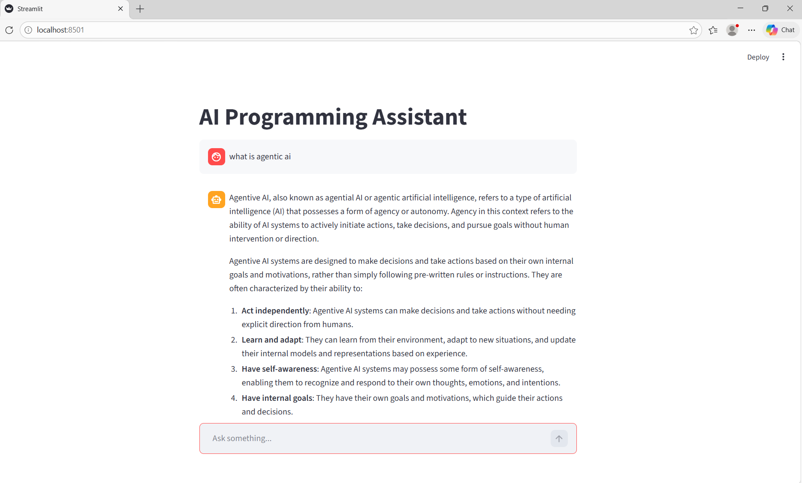

# AI Chatbot using Groq API

A simple command-line AI chatbot built with Python and the Groq API using the Llama 3.1 model.  
The chatbot supports conversational memory and secure API key management using environment variables.

---

## Features
- Conversational chatbot interface
- Maintains conversation context
- Secure API key management using `.env`
- Lightweight CLI application

---

## Tech Stack
- Python
- Groq API
- Llama 3.1
- dotenv

---

## Project Structure

ai-chatbot/
│
├── app.py
├── requirements.txt
├── .env.example
├── README.md
└── screenshots/
    └── chatbot-ui.png

---

## Installation

Clone the repository:

git clone https://github.com/gaganpreet-dev/groq-ai-chatbot

Navigate into the project directory:

cd ai-chatbot

Install dependencies:

pip install -r requirements.txt

---

## Setup

Create a `.env` file in the root directory:

GROQ_API_KEY=your_api_key_here

---

## Run the Chatbot

python app.py

---

## Screenshot

---

## Future Improvements
- Web interface using Streamlit or React
- Multi-agent conversation support
- Docker containerization